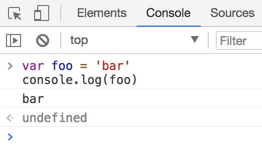
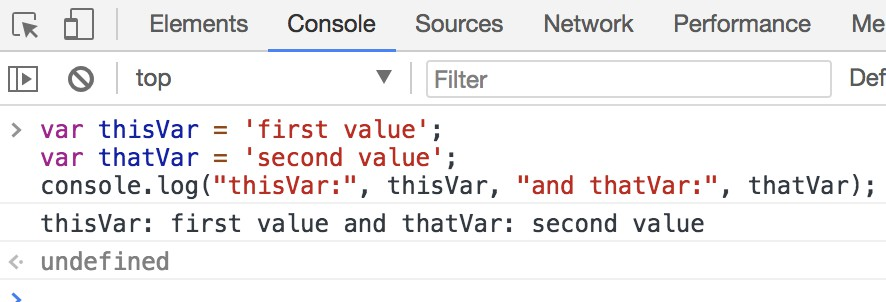
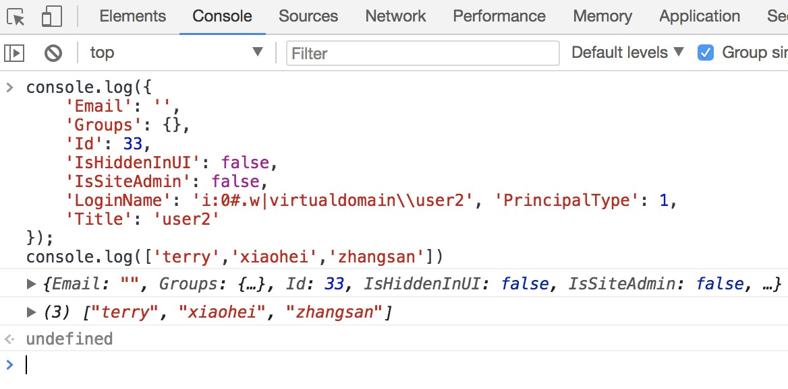
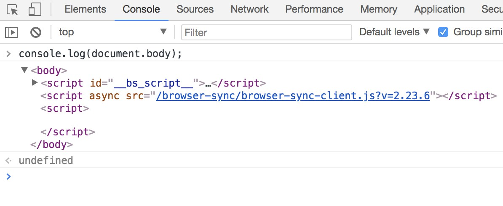

## 使用console.log()
### 介绍
所有现代Web浏览器，Node.js以及几乎所有其他JavaScript环境都支持使用一套日志记录方法将消息写入控制台。 这些方法中最常见的是console.log（）。
在浏览器环境中，console.log（）函数主要用于调试目的。
### 入门
在浏览器中打开JavaScript控制台，输入以下内容并按Enter键：
```js
console.log("Hello, World!");
```
这会将以下内容记录到控制台：


在上面的例子中，console.log（）函数输出Hello，World！ 到控制台并返回未定义（在控制台输出窗口中显示）。 这是因为console.log（）没有显式的返回值。
### 记录变量
console.log（）可用于记录任何类型的变量; 不仅是字符串。 只需传入想要在控制台中显示的变量，例如：
```js
var foo = "bar";
console.log(foo);
```
这会将以下内容记录到控制台：


如果您想记录两个或更多值，只需用逗号分隔它们即可。 连接期间，每个参数之间会自动添加空格：
```js
var thisVar = 'first value';
var thatVar = 'second value';
console.log("thisVar:", thisVar, "and thatVar:", thatVar);
```
这会将以下内容记录到控制台：

### 占位符

你可以将console.log（）与占位符结合使用：
```js
//替换字符串
var greet = "Hello",who = "World"; 
console.log("%s, %s!", greet, who);
console.log("Hello I am a %s string!", "💩");
// Styled  设置样式
console.log('%c 我的字体变大啦', 'font-size:50px;');

```
这会将以下内容记录到控制台：

### 输出对象或数组
下面我们看到记录一个对象的结果。 这通常用于记录来自API调用的JSON响应。
```js
console.log({
    'Email': '',
    'Groups': {},
    'Id': 33,
    'IsHiddenInUI': false,
    'IsSiteAdmin': false,
    'LoginName': 'i:0#.w|virtualdomain\\user2', 'PrincipalType': 1,
    'Title': 'user2'
});
console.log(['terry','xiaohei','zhangsan'])
```
这会将以下内容记录到控制台：

### 记录HTML元素
您可以记录DOM中存在的任何元素。 在这种情况下，我们记录body元素：
```js
console.log(document.body);
```
这会将以下内容记录到控制台：


### 扩展内容
开发工具Console 的更多使用：
* log
* warn 
* error
* info
* clear
* dir
* groupCollapsed
* groupEnd
* count 
* time 
* timeEnd
可在控制台中输入查看具体作用
```js
   const dogs = [{
            name: 'Snickers',
            age: 2
        }, {
            name: 'hugo',
            age: 8
        }];

        function makeGreen() {
            const p = document.querySelector('p');
            p.style.color = '#BADA55';
            p.style.fontSize = '50px';
        }
        // Regular  //基本
        console.log('consoe.log test')
        // Interpolated 替换字符串
        console.log("Hello I am a %s string!", "💩");
        // Styled  设置样式
        console.log('%c 我的字体变大啦', 'font-size:50px;');
        console.log("I am a string: %s ", "log"); //log
        console.log("I am a float number: %f ", 1.23); //1.23
        console.log("I am a object: %o ", {
            name: "allen"
        }); // {name:"allen"}
        console.log("I am a int number: %d ", 1); //1
        console.log("%c other style", "color: #00fdff; font-size: 2em;");

        // 各式不同的訊息類型
        // warning!
        console.warn("OH NOOO");
        // Error :|
        console.error("OH NOOO");
        // Info
        console.info("OH NOOO");

        // Testing
        const p = document.querySelector("p");
        console.assert(p.classList.contains("ouch"), "That is wrong!");

        // clearing 清除 console
        console.clear();

        // Viewing DOM Elements
        console.log(p);
        console.dir(p);
        console.clear();

        // Grouping together
        dogs.forEach(dog => {
            // 此是分组标题文字
            console.groupCollapsed(`${dog.name}`);
            console.log(`This is ${dog.name}`);
            console.log(`${dog.name} is ${dog.age} years old`);
            console.log(`${dog.name} is ${dog.age * 7} dog years old`);
            console.groupEnd(`${dog.name}`);
        });

        // counting
        console.count("Wes");
        console.count("Wes");
        console.count("Steve");
        console.count("Steve");
        console.count("Wes");
        console.count("Steve");
        console.count("Wes");
        console.count("Steve");
        console.count("Steve");
        console.count("Steve");
        console.count("Steve");
        console.count("Steve");

        // timing
        console.time("fetching data"); //启动一个计时器
        fetch("https://api.github.com/users/wesbos")
            .then(data => data.json())
            .then(data => {
                console.timeEnd("fetching data");//毫秒为单位 显示
                console.log(data);
            });
```

